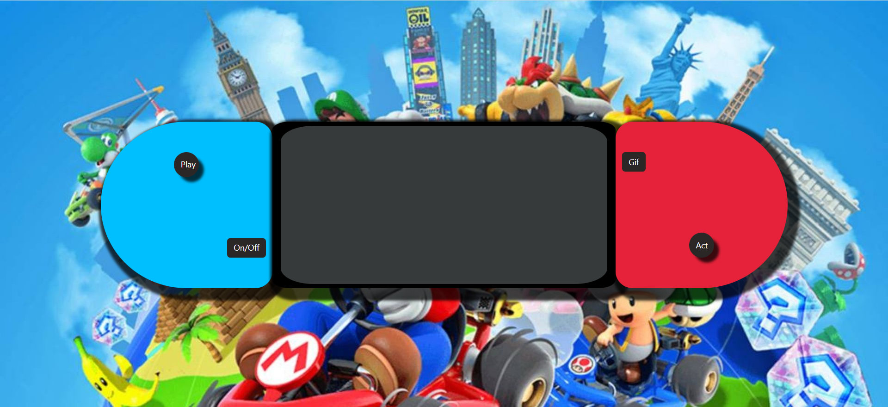
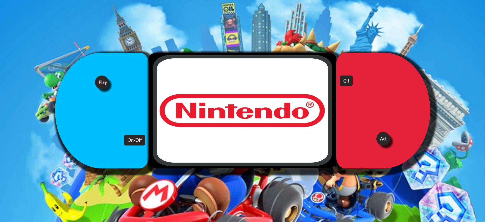
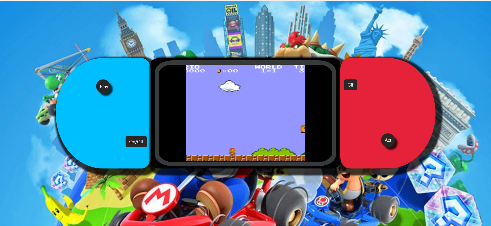
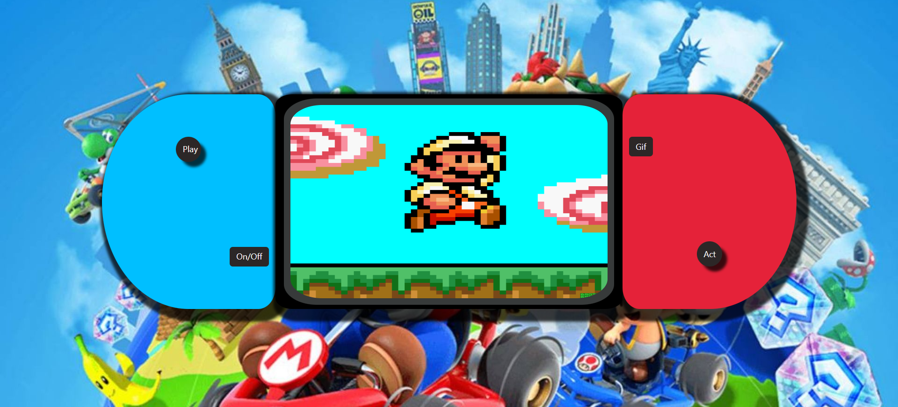

#

#### Table of Contents

- [How to run](#How-to-run-)
- [DB](#DB-)
- [Backend](#Backend-)
    -[User endpoints](#USER)
    -[Product endpoints](#MOVIE)

-  [Frontend](#Fronted-)

#

## CONSOLA DE NINTENDO SWITCH -[Frontend](#Frontend-)

Les presento mi segundo proyecto, una Consola de Nintendo Switch con dos comandos uno del lado derecho y otro del lado izquierdo.

Consta de cuatro botones interactivos:

-On/Off
-Play
-Gif
-Actualización (Act)

Del lado izquierdo encontramos un boton inferior que nos permite encender y apagar la consola.

Al hacer clic en el boton de la parte superior podemos jugar un videojuego de MarioBross.

Del lado derecho encontramos un boton inferior que nos llevara a una actualizacion de dicha consola y por ultimo pero no menos importante en la parte superior encontramos un GifDivertido de MarioBross.

## AUTOR 

    Yudith Brandao

## INFORMACION DE CONTACTO

    Telefono Mobil: +58 000 000
    Gmail yudi@brandao.com

## SECCION DE BUGS CONOCIDOS

    En ocasiones el juego aparece mas grande de lo debido... Se encuentra en reparacion...
